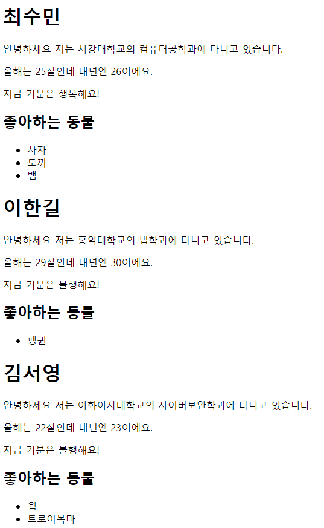

# react-profile

## 목차

1. [서론](#서론)
2. [진행 방식](#진행-방식)
3. [미션 제출 방법](#미션-제출-방법)
4. [프로그램 실행 결과](#프로그램-실행-결과)
5. [프로그래밍 요구 사항](#프로그래밍-요구-사항)
6. [고민거리](#고민거리)
7. [미션 저장소 및 진행 요구 사항](#미션-저장소-및-진행-요구-사항)
   > 서론, 진행방식, 미션 제출 방법은 1주차에만 공지된다.

## 서론

안녕하세요. 10기 운영진 최수민입니다!

1주차 미션은 개발환경을 세팅하고, github에 과제를 제출하는 등 미션 외에도 추가로 익혀야 하는 부분들이 있어 가벼운 미션으로 준비했어요.

구글링을 통해 해결하셔도 좋고, 지정해드린 강의인 생활코딩 - React를 참고하셔도 좋습니다! (아마 생활코딩 강의를 수강하시면 아주 쉽게 해결하실 수 있을거에요)

1주차와 2주차 미션은 React 자체에 익숙해지기 위한 시간으로, 여러가지 제약조건을 드릴 생각입니다.

제약 조건을 맞추면서 최대한 React스러운 코드를 디자인하기 위해서 고민해보는 시간을 가져주셨으면 합니다. 
왜 이런 제약 조건을 줬을까? 하고 고민해보는 것도 좋겠네요.

미션 제출은 본인이 완성했다고 생각하는 언제라도 제출할 수 있습니다. 단, 제출한 시점 이후에 수정은 불가하니 착오 없기를 바랍니다.

1주차 미션 마감일시는 2019년 9월 29일 까지이며, 완료하지 못 하셨더라도 `스터디 참여에 어떠한 불이익도 없습니다.`

사실 너무 늦게 공지 드려서 죄송한 마음이 크네요.. 미리 강의를 숙지하고 그에 맞춰서 연습 문제 및 모범 답안을 준비하느라 조금 늦었습니다 ㅠ

다음 미션부터는 늦지 않게 미리미리 드릴테니 걱정 않으셔도 됩니다!

이 미션을 진행하는 시간이 고통이 아니라 즐거운 시간이기를 기대해 봅니다.

궁금한 점은 모두에게 공유하기 위해서 슬랙의 qna채널에 올려주세요! 감사합니다 ^\_\_\_\_\_^

## 진행 방식

- 매주 진행할 미션은 일요일에 공지되고, 다음 스터디 전까지 구현을 완료해 해당 레포에 PR 되어야 한다.
- 매주 미션은 기능 요구사항, 프로그래밍 요구사항, 과제 진행 요구사항, 고민거리 네 가지로 구성되어 있다. (1주차에서 기능 요구사항은 제외한다)
- 세 개의 요구사항을 만족하기 위해 노력한다. 특히 기능을 구현하기 전에 기능 목록을 만들고, 기능 단위로 commit하는 방식으로 진행한다.
- 고민거리에 제시된 주제는 본인이 직접 고민해도 좋고, 검색을 통해 정보를 탐색해도 좋다. 각자의 방법에 의해 얻게 된 통찰을 기록한다.

## 미션 제출 방법

- 미션 구현을 완료한 후 GitHub을 통해 제출해야 한다. (방법은 [스터디 과제제출](../how-to-submit/README.md)문서를 참고한다.)

## 프로그램 실행 결과

## 프로그래밍 요구사항

- Props, State를 모두 활용한다.
- 각 Component는 모두 다른 파일에 작성한다.
- 모든 Component는 /src 내에 작성한다.
- Component 이름은 항상 대문자로 시작한다.
- 모든 Component를 class형 Component로 작성한다.
- prop이름은 항상 camelCase(소문자로 시작)을 사용한다.

## 고민거리

1.  Props와 State는 어떤 상황에서 다르게 사용될까?

## 미션 저장소 및 진행 요구 사항

- 미션은 이 저장소를 fork/clone해 시작한다.
- clone된 폴더의 README.md의 내용을 모두 지운 뒤 구현할 Component 및 각 Component가 갖는 props, state를 정리해 추가한다.
- git의 commit 단위는 앞 단계에서 README.md 파일에 정리한 Component 단위로 추가한다.
- 고민거리에 제시된 주제들에 대한 답변도 README.md 파일에 정리해 추가한다.
- [스터디 과제제출](../how-to-submit/README.md) 문서를 참고해 미션을 제출한다.
